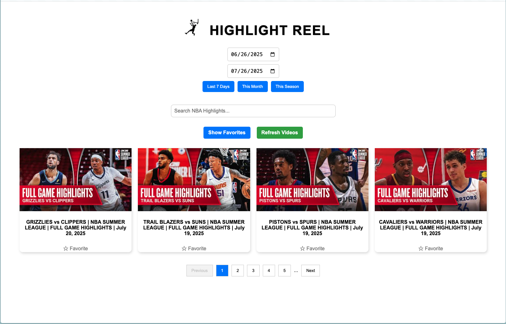

# NBA Highligt Reel




A full-stack NBA highlight browser that lets users search and filter YouTube highlight videos by date, powered by the YouTube Data API v3.

## 📦 Tech Stack

- **Frontend**: [React](https://react.dev/) + [Vite](https://vitejs.dev/)
- **Backend**: [Express.js](https://expressjs.com/)
- **API**: [YouTube Data API v3](https://developers.google.com/youtube/v3)
- **Environment**: Vercel (client) + Render (server)
- **Cache + Rate Limiting**: In-memory & `express-rate-limit`

## ✨ Features

- Browse NBA highlight videos by date
- Search by title (e.g. "Full Game Highlights")
- Pagination + favorites with local storage
- Caches YouTube API requests (5 min)
- Rate limits API to avoid quota abuse

## 📂 Project Structure

<pre> ```
highlight-reel/
├── client/ # React frontend (Vite)
├── server/ # Express backend (YouTube proxy)
├── .gitignore
└── README.md
``` </pre>

## 🚀 Getting Started (Local)

## 1. Clone the repo

git clone https://github.com/your-username/highlight-reel.git
cd highlight-reel

### 2. Setup environment variables
Copy and configure the .env files:

<pre> ```
cp client/.env.example client/.env
cp server/.env.example server/.env
``` </pre>

Update:

YOUTUBE_API_KEY in server/.env

Proxy target in client/.env (already defaults to localhost)


### 3.  Start the app
Open two terminals:

🔹 Terminal 1: Server
bash
Copy
Edit
cd server
npm install
node index.js
🔹 Terminal 2: Client
bash
Copy
Edit
cd client
npm install
npm run dev
Visit http://localhost:5173

# 🌐 Deployment
Vercel (Client)
Deploy /client folder

Set VITE_API_BASE_URL=https://your-backend.onrender.com/api/ in Vercel env settings

Render (Server)
Deploy /server folder

Set:

YOUTUBE_API_KEY=...

CLIENT_ORIGIN=https://highlight-reel.vercel.app


# 🔐 Security
API key is stored on the backend only

Frontend talks to a /api/videos proxy

Rate-limited to prevent abuse

CORS configured for your frontend origin

# 🧠 Notes & Future Ideas
Add persistent favorites (DB or Supabase)

Use Redis or filesystem cache for serverless-friendly caching

Add unit tests for video filtering

Add a "Team filter" or "Game of the Day" feature

Swap in YouTube Playlist API for more control

# 📄 License
MIT — use, modify, and learn from it.

💬 Author
Built by Caleb Matteis
